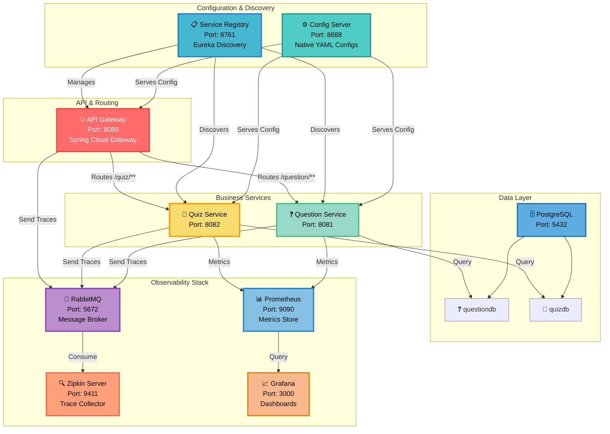
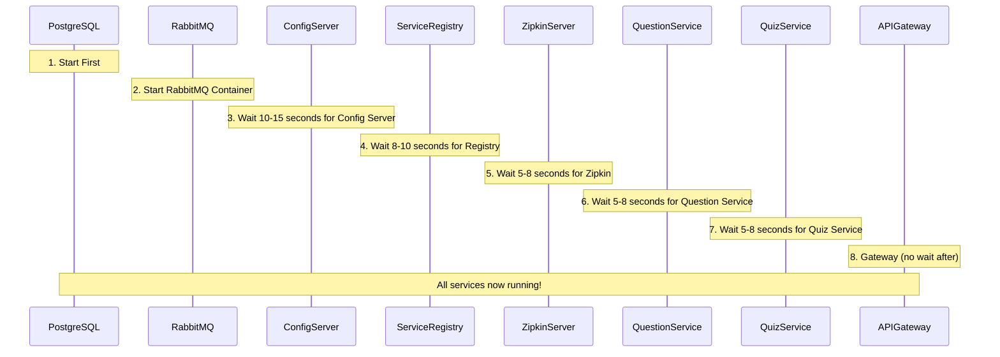

# 🏛️ QuizCloud Infrastructure Setup

> **Comprehensive guide to the distributed microservices infrastructure powering QuizCloud**

---

## 📐 Infrastructure Overview



---

## 🔧 Infrastructure Components

### Core Services

| Component | Port | Technology | Purpose | Location |
|-----------|------|-----------|---------|----------|
| **Config Server** | 8888 | Spring Cloud Config | Centralized configuration management | `config-server/` |
| **Service Registry** | 8761 | Netflix Eureka | Service discovery & registration | `service-registry/` |
| **API Gateway** | 8080 | Spring Cloud Gateway | Request routing & load balancing | `api-gateway/` |
| **Question Service** | 8081 | Spring Boot + JPA | Question management APIs | `question-service/` |
| **Quiz Service** | 8082 | Spring Boot + Resilience4j | Quiz APIs with circuit breakers | `quiz-service/` |
| **Zipkin Server** | 9411 | Zipkin + Spring Boot | Distributed trace collection | `zipkin-server/` |

### Infrastructure Services

| Component | Port | Technology | Purpose | Running |
|-----------|------|-----------|---------|---------|
| **PostgreSQL** | 5432 | PostgreSQL 13+ | Relational database | Local/External |
| **RabbitMQ** | 5672 | RabbitMQ 3.x | Message broker | Docker |
| **RabbitMQ UI** | 15672 | RabbitMQ Management | RabbitMQ management console | Docker |
| **Prometheus** | 9090 | Prometheus | Metrics time-series DB | Docker Compose |
| **Grafana** | 3000 | Grafana | Metrics visualization | Docker Compose |

---

## ⚙️ Configuration Server Setup

### Native Profile Configuration

The Config Server operates in **native** mode, serving configuration from local YAML files:

```properties
spring.cloud.config.server.native.search-locations=file:./configs,file:./config-server/configs
spring.profiles.active=native
```

### Configuration Files Structure

```
config-server/configs/
├── api-gateway.yml
│   ├── Server port: 8080
│   ├── Route configurations for /question/** and /quiz/**
│   ├── Actuator endpoints
│   └── Tracing settings
├── question-service.yml
│   ├── Database connection: questiondb
│   ├── Datasource credentials (postgres/password)
│   ├── JPA/Hibernate settings
│   └── Actuator metrics
├── quiz-service.yml
│   ├── Database connection: quizdb
│   ├── OpenFeign client configuration
│   ├── Resilience4j circuit breaker settings
│   └── Metrics configuration
└── service-registry.yml
    ├── Eureka server configuration
    ├── Self-registration disabled
    └── Actuator settings
```

### Client Configuration Bootstrap

All microservices load configuration via `bootstrap.properties`:

```properties
# bootstrap.properties (in each service)
spring.cloud.config.uri=http://localhost:8888
spring.config.import=configserver:http://localhost:8888
spring.cloud.config.fail-fast=true
```

**⚠️ Critical Setting**: `fail-fast=true` means services **will not start** if Config Server is unavailable. This is intentional for production safety.

---

## 🗄️ Database Infrastructure

### PostgreSQL Setup

#### Prerequisites
- PostgreSQL 13+ installed and running on `localhost:5432`
- Default role: `postgres` with password `password`

#### Database Creation

```bash
# Create question database
psql -U postgres -c "CREATE DATABASE questiondb;"

# Create quiz database
psql -U postgres -c "CREATE DATABASE quizdb;"

# Load initial question data
psql -U postgres -d questiondb -f question-table-data.sql
```

#### Database Configuration

Both services use the same PostgreSQL instance with separate databases:

**Question Service (`config-server/configs/question-service.yml`):**
```yaml
spring:
  datasource:
    url: jdbc:postgresql://localhost:5432/questiondb
    username: postgres
    password: password
    driver-class-name: org.postgresql.Driver
```

**Quiz Service (`config-server/configs/quiz-service.yml`):**
```yaml
spring:
  datasource:
    url: jdbc:postgresql://localhost:5432/quizdb
    username: postgres
    password: password
    driver-class-name: org.postgresql.Driver
```

---

## 🐰 Message Broker Setup (RabbitMQ)

### Docker Container Setup

RabbitMQ is used as the **message transport** for distributed tracing:

```bash
docker run -d \
  --name rabbitmq \
  -p 5672:5672 \
  -p 15672:15672 \
  rabbitmq:3-management
```

### Port Mappings

| Port | Service | Purpose |
|------|---------|---------|
| **5672** | AMQP | Message broker protocol |
| **15672** | Management UI | Administration dashboard |

### Access Credentials

- Default Username: `guest`
- Default Password: `guest`
- Management UI: http://localhost:15672

### RabbitMQ Configuration in Services

Services connect to RabbitMQ for trace delivery:

```yaml
spring:
  rabbitmq:
    host: localhost
    port: 5672
    username: guest
    password: guest
```

---

## 📊 Monitoring Stack (Prometheus & Grafana)

### Docker Compose Setup

The monitoring stack is defined in `monitoring/docker-compose.yml`:

```bash
cd monitoring
docker compose up -d
```

### Prometheus Configuration

**File**: `monitoring/prometheus.yml`

```yaml
global:
  scrape_interval: 15s

scrape_configs:
  - job_name: 'config-server'
    static_configs:
      - targets: ['localhost:8888']
  - job_name: 'service-registry'
    static_configs:
      - targets: ['localhost:8761']
  - job_name: 'api-gateway'
    static_configs:
      - targets: ['localhost:8080']
  - job_name: 'question-service'
    static_configs:
      - targets: ['localhost:8081']
  - job_name: 'quiz-service'
    static_configs:
      - targets: ['localhost:8082']
```

### Grafana Configuration

- **Default URL**: http://localhost:3000
- **Default Credentials**: `admin` / `admin`
- **Data Source**: Prometheus (http://prometheus:9090)
- **Storage**: Docker volume `grafana-storage`

---

## 🔄 Service Startup Sequence

The startup order is **critical** for proper service initialization:



### Detailed Startup Checklist

```
✅ Step 1: Prepare Infrastructure
   └─ Ensure PostgreSQL is running
   └─ Ensure Docker is running
   
✅ Step 2: Start External Services
   └─ RabbitMQ: docker run -d --name rabbitmq -p 5672:5672 -p 15672:15672 rabbitmq:3-management
   └─ Prometheus/Grafana: cd monitoring && docker compose up -d
   
✅ Step 3: Start Config Server (⏱️ Wait 10-15 seconds)
   └─ cd config-server && mvn spring-boot:run
   
✅ Step 4: Start Service Registry (⏱️ Wait 8-10 seconds)
   └─ cd service-registry && mvn spring-boot:run
   
✅ Step 5: Start Zipkin Server (⏱️ Wait 5-8 seconds)
   └─ cd zipkin-server && mvn spring-boot:run
   
✅ Step 6: Start Question Service (⏱️ Wait 5-8 seconds)
   └─ cd question-service && mvn spring-boot:run
   
✅ Step 7: Start Quiz Service (⏱️ Wait 5-8 seconds)
   └─ cd quiz-service && mvn spring-boot:run
   
✅ Step 8: Start API Gateway (⏱️ No wait required)
   └─ cd api-gateway && mvn spring-boot:run
```

---

## 🔍 Health Verification

### Service Health Endpoints

```bash
# Config Server
curl http://localhost:8888/actuator/health

# Service Registry
curl http://localhost:8761/eureka/apps

# API Gateway
curl http://localhost:8080/actuator/health

# Question Service
curl http://localhost:8081/actuator/health

# Quiz Service
curl http://localhost:8082/actuator/health

# Zipkin Server
curl http://localhost:9411/health
```

### Dashboard Access

| Dashboard | URL | Purpose |
|-----------|-----|---------|
| 📋 Eureka Registry | http://localhost:8761 | View registered services |
| 🔍 Zipkin Traces | http://localhost:9411 | View distributed traces |
| 📊 Prometheus | http://localhost:9090 | Query metrics |
| 📈 Grafana | http://localhost:3000 | View dashboards |
| 🐰 RabbitMQ | http://localhost:15672 | Manage queues & connections |

---

## 🛡️ Network & Communication Flow

### Request Flow (External → Internal)

```
Client Request
    ↓
API Gateway (8080)
    ↓
    ├→ Question Service (8081)
    │   ├→ PostgreSQL (5432)
    │   └→ Traces → RabbitMQ
    │
    └→ Quiz Service (8082)
        ├→ PostgreSQL (5432)
        ├→ Question Service (OpenFeign)
        └→ Traces → RabbitMQ
        
    All → Prometheus metrics collection
    RabbitMQ → Zipkin trace aggregation
```

### Configuration Propagation Flow

```
Config Server (8888)
    ↓
    ├→ API Gateway
    ├→ Question Service
    ├→ Quiz Service
    └→ Service Registry
```

---

## 📝 Important Configuration Notes

1. **PostgreSQL Credentials**: Update in `config-server/configs/question-service.yml` and `config-server/configs/quiz-service.yml` if different from `postgres/password`

2. **Config Server Must Start First**: All other services depend on it with `fail-fast=true`

3. **Service Registration**: Services self-register with Eureka on startup

4. **Trace Sampling**: Set to 100% locally for development (`spring.trace.sampling.probability=1.0`)

5. **Actuator Exposure**: All metrics and health endpoints are exposed via `/actuator/**`

---

## 🔧 Troubleshooting Infrastructure

### Config Server Connection Timeout
```
Error: Could not locate PropertySource
Solution: Ensure Config Server is fully started (wait 15 seconds) before starting dependent services
```

### Eureka Registration Failures
```
Error: Cannot register with service registry
Solution: Verify Service Registry is running on port 8761
```

### RabbitMQ Connection Refused
```
Error: rabbit connection refused
Solution: Check RabbitMQ container: docker ps | grep rabbitmq
Restart: docker stop rabbitmq && docker start rabbitmq
```

### Database Connection Issues
```
Error: org.postgresql.util.PSQLException: Connection refused
Solution: Ensure PostgreSQL is running and both databases exist
Check: psql -U postgres -c "\l"
```

---

**Infrastructure setup guide completed! 🎉**

Prometheus scrapes:

```text
host.docker.internal:8080/actuator/prometheus
host.docker.internal:8081/actuator/prometheus
host.docker.internal:8082/actuator/prometheus
host.docker.internal:8761/actuator/prometheus
```

Dashboards:

- Prometheus: `http://localhost:9090`
- Grafana: `http://localhost:3000`

Grafana admin password is configured as `admin` in `monitoring/docker-compose.yml`.

## Distributed Tracing

Tracing is configured through Micrometer/Brave with 100% local sampling:

```yaml
management:
  tracing:
    sampling:
      probability: 1.0
```

The configured Zipkin endpoint is:

```text
http://localhost:9411/api/v2/spans
```

Zipkin UI:

```text
http://localhost:9411/zipkin/
```

## API Gateway Routes

Gateway config is in `config-server/configs/api-gateway.yml`.

```yaml
routes:
  - id: question-service-route
    uri: lb://question-service
    predicates:
      - Path=/question/**
  - id: quiz-service-route
    uri: lb://quiz-service
    predicates:
      - Path=/quiz/**
```

Use:

```text
http://localhost:8080/question/allQuestions
http://localhost:8080/quiz/create
```

## Health Checks

```bash
curl http://localhost:8888/actuator/health
curl http://localhost:8761/actuator/health
curl http://localhost:8080/actuator/health
curl http://localhost:8081/actuator/health
curl http://localhost:8082/actuator/health
curl http://localhost:9411/health
```

## Config Lookup URLs

```bash
curl http://localhost:8888/api-gateway/default
curl http://localhost:8888/question-service/default
curl http://localhost:8888/quiz-service/default
curl http://localhost:8888/service-registry/default
```

## Troubleshooting

- Config clients fail on startup: start Config Server first and verify `http://localhost:8888/actuator/health`.
- Services missing from Eureka: verify `http://localhost:8761` and restart the service after Config Server is healthy.
- Database errors: create `questiondb` and `quizdb`, then confirm credentials in the config server YAML files.
- Prometheus targets down: verify Java services are running on the host and Docker supports `host.docker.internal`.
- No traces in Zipkin: verify RabbitMQ on `5672` and Zipkin on `9411`.

## Versions

- Java: 17
- Spring Boot: 3.5.14
- Spring Cloud: 2025.0.0
- Resilience4j: 2.1.0
- Zipkin: configured in `zipkin-server/pom.xml`

